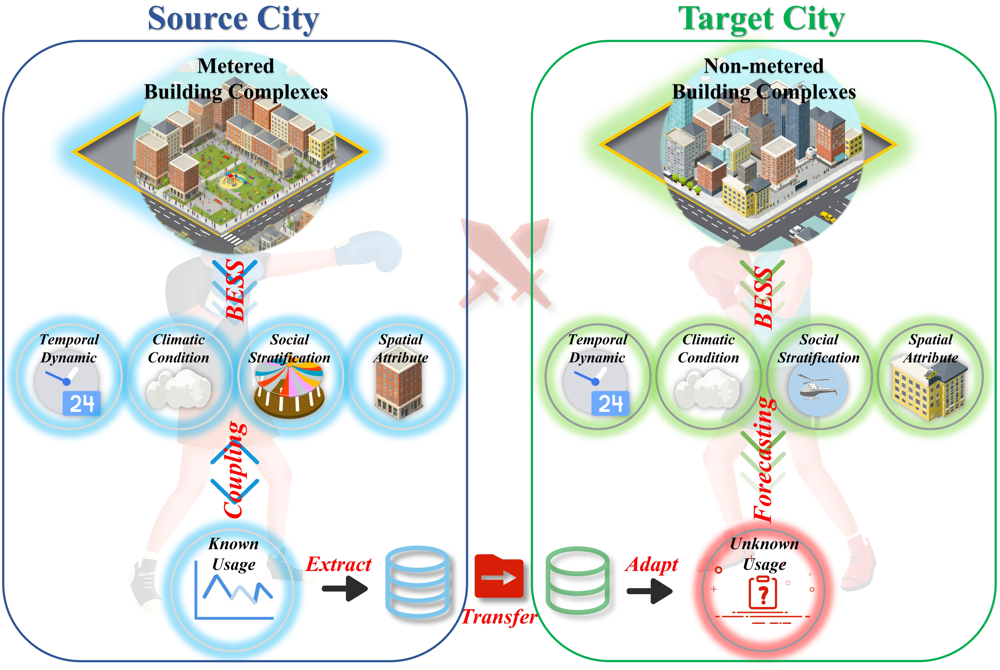
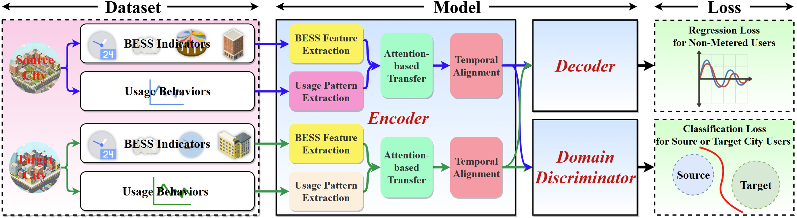

# AdaAqua

**AdaAqua** is an adversarial domain adaptation neural network designed for cross-city water-use pattern transfer. It adaptively transfers water-use patterns from data-rich source cities to a data-scarce target city by leveraging users’ **Built-Environment and Social-Stratification (BESS)** indicators.

**Paper:** *Cross-City Water-use Pattern Transfer: An Adversarial Domain Adaptation Deep Learning Method for Real-time Demand Estimation in Non-metered Residential Users*  
**Authors:** Zekun Zou, Tingchao Yu  

---

## 📜 Abstract

Limited real-time observability of urban users without high-frequency flow meters remains a major barrier to demand perception in urban water systems. Transferring water-use patterns from metered users to non-metered users provides a practical pathway for reconstructing high-resolution demand profiles under sparse sensing conditions. However, sensor coverage within a single city may not span sufficiently diverse water-use contexts, which limits the reliability of intra-city transfer.

To address this challenge, this study proposes **AdaAqua**, an adversarial domain adaptation framework for cross-city water-use pattern transfer. AdaAqua estimates high-resolution demand for non-metered residential complexes by extracting transferable water-use patterns from data-rich source cities and adapting them to a data-scarce target city. Built-Environment and Social-Stratification indicators are used as contextual anchors to guide pattern matching and domain adaptation across urban contexts.

Three-fold cross-validation in a data-scarce target city shows that AdaAqua achieves an average **MAE of 1.50 m³/h**, **MAPE of 29.4%**, and **R² of 0.60**, demonstrating its effectiveness for real-time demand estimation under sparse sensing conditions.

---

## 🧠 Model Architecture

*Overall architecture of the AdaAqua model proposed in this study.*

---

## 🚀 Quick Start

### Repository Contents

This repository contains the dataset and six experiment folders used in the study.

### Dataset

The dataset folder stores the source-domain data and target-domain data separately:

- **Source domain:** `ZZ`
- **Target domain:** `ZB`

The dataset includes:

- **H5 files:** Store data with dimensions of residential complexes × time steps × features.
- **CSV files:** Store water-bill information for the residential complexes corresponding to each H5 file.

### Experiments

Each experiment folder contains a `Main.ipynb` file. To run the experiments, adjust the file paths in the notebook according to your local directory structure.

The experiment folders include:

- **Exp_AblationExperiment**  
  Contains ablation studies used to evaluate the contribution of key components in AdaAqua.

- **Exp_ReplacementExperiment**  
  Contains replacement experiments used to compare AdaAqua with simplified model architectures.

- **Exp_DomainAdversarialIntensity**  
  Evaluates the effect of domain-adversarial strength. A domain-adversarial intensity of `0.1` is used as the representative setting in this repository.

- **Exp_OnlyTargetDomain**  
  Contains experiments using only target-domain data, which are used to evaluate the benefit of incorporating source-domain data.

- **Exp_SourceSparse**  
  Contains experiments with 100 source-domain samples, which are used to examine the influence of source-domain data richness on transfer performance.

- **Exp_TargetSparse**  
  Contains experiments with 7 target-domain samples, which are used to evaluate the robustness of AdaAqua under target-domain data scarcity.

---

## ⚙️ Operation Environment

The code was tested under the following environment:

- **Python:** `3.12.3`
- **CUDA:** `12.1`
- **PyTorch:** `2.3.0+cu121`
- **NumPy:** `1.26.4`
- **Pandas:** `2.2.2`

---

## 📬 Contact

For questions or further information, please contact:

**Zekun Zou**  
zekunzou@zju.edu.cn
